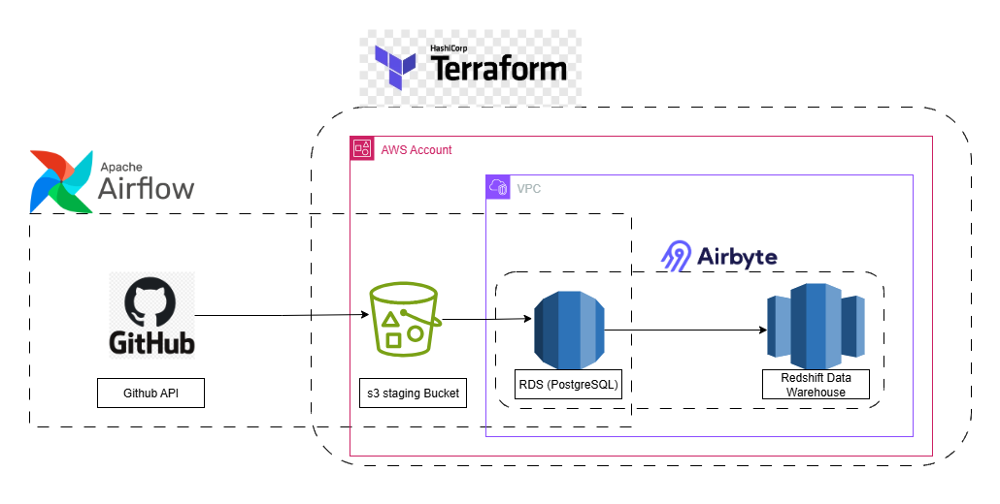
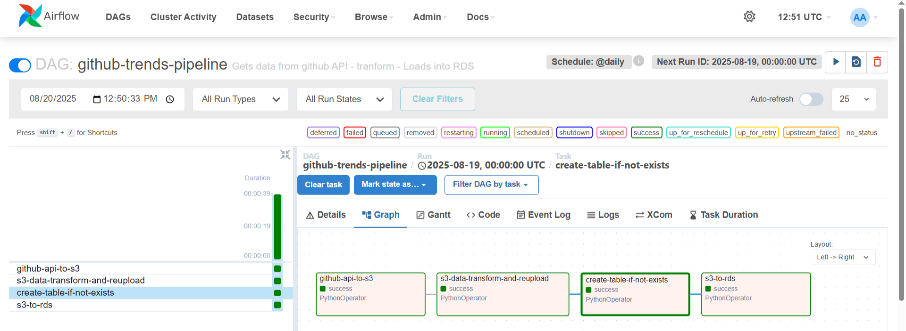
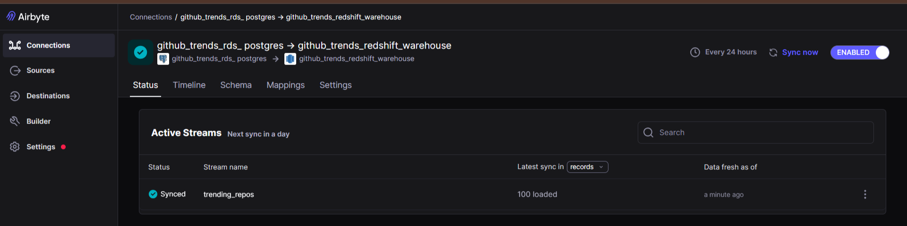
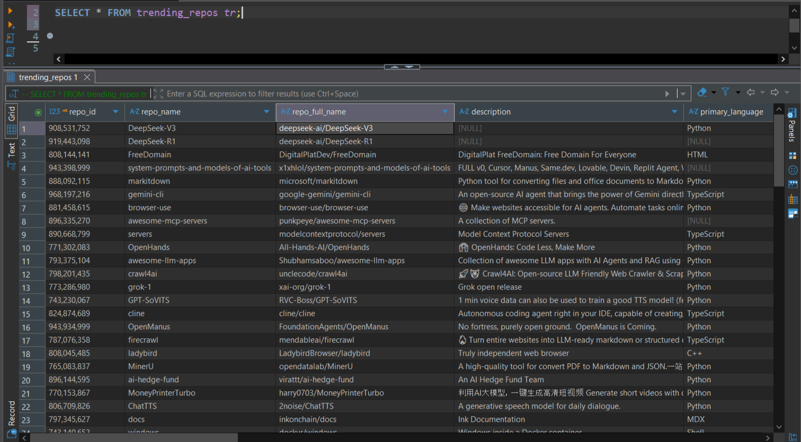

# GitHub Trends Data Pipeline

This is a cloud-based ETL pipline that extracts trending public repositories on Github via the [Github API](https://docs.github.com/en/rest/search/search?apiVersion=2022-11-28#search-repositories), stores them in AWS RDS (PostgreSQL) and syncs the data to AWs Redshift using Airbyte for the purpose of analytics   

**Orchestrated using apache airflow, provisioned with Terraform**

## Architecture



## Tech Stack

+ Orchestration -> Apache Airflow
+ Infrastructure -> Terraform
+ Storage -> AWS RDS (PostgreSQL), AWS Redshift
+ Data Transfer -> Airbyte
+ Language -> Python3.11

## Features

+ Automated daily extraction of trending Github repositories
+ Transformation of extracted data for consistent structure
+ Infrastructure provisioning with Terraform
+ Incremental Sync from RDS to Redshift via Airbyte

## Project Structure

```plaintext
.
├── airflow/          # Airflow DAGs, ETL scripts, utils, docker files
│   ├── dags/
|   ├── compose.yaml
|   ├── Dockerfile
│   └── README.md
├── infrastructure/   # Terraform IAC for AWS resources
│   ├── providers.tf
│   ├── backend.tf
│   ├── variables.tf
│   ├── vpc.tf
│   ├── rds.tf
│   ├── redshift.tf
│   ├── airflow_iam.tf
│   ├── redshift_iam.tf
│   └── README.md
├── images/            # Images
└── README.md          # Documentation
```

## Getting Started

### What you need

+ AWS account with admin-level permissions
+ Terraform 
+ Python3
+ Docker (Used to provision Airflow Locally)
+ Minikube (Used to provision airbyte locally)

### Infrastructure Setup

```bash
cd infrastructure
terraform init
terraform plan
terraform apply
```

This provisions VPC, RDS, Redshift, IAM    
The backend state is stored in S3 bucket

---

### Airflow Setup (Docker)

+ Navigeate to the Airflow Directory
  ```bash
  cd airflow
  ```
+ Initialize airflow using docker compose
  ```bash
  docker compose up airflow-init
  ```
+ Spin up Airflow services using docker compose
  ```bash
  docker compose up -d
  ```
+ Login to Airflow user interface on [localhost:8080](localhost:8080). The default airflow credentials are

  ```
  # username: airflow
  # password: airflow
  ```

+ Setup Connection and Variables
  + **Postgres connection**

    | Field | Meaning |
    | - | - | 
    | Connection Id | This should be named "RDS_POSTGRES_CONN" |
    | Connection Type | `Postgres` |
    | Host | Also called endpoint on AWS console | 
    | Database | The name of the database defined on RDS - also defined in [variables.tf](./infrastructure/variables.tf) file | 
    | Login | Username as defined in the infrastructure, stored on AWS secrets manager |
    | Password | Password as defined in the infrastructure, stored on AWS secrets manager | 
    | Port | Database port |

  + **AWS Connection**

    | Field | Meaning |
    | - | - | 
    | Connection Id | This should be named "AWS_CONN" |
    | Connection Type | `Amazon Web Services` |
    | AWS Access Key ID	| Access key as defined in the infrastructure, stored on AWS secrets manager |
    | AWS Secret Access Key	| Secret key as defined in the infrastructure, stored on AWS secrets manager | 

  + **Variables**
    + AWS_BUCKET_NAME - Name of the staging bucket used in Airflow
    + AWS_REGION - Region to be attached to the AWS connecton
  
+ Enable `github-trends-pipeline` DAG

### Airbyte : RDS → Redshift

+ Source: AWS RDS (PostgreSQL)
+ Destination: AWS Redshift
+ Sync mode: Incremental + Append
+ Schedule: Every 24 hours

## Data Schema

| Column | Type | Description |
| -- | - | - |
| repo_id | BIGINT | Unique repo ID from GitHub |
| repo_name | TEXT | Repository name |
| repo_full_name | TEXT | Owner/repo_name |
| description | TEXT  | Repo description (nullable) |
| primary_language | TEXT | Main programming language used |
| no_of_stars | BIGINT | Stargazer count |
| no_of_forks | BIGINT | Fork count |
| no_of_watchers | BIGINT | Watcher count |
| no_of_open_issues | SMALLINT    | Open issues count |
| repo_created_at | TIMESTAMPTZ | Creation date |
| repo_updated_at | TIMESTAMPTZ | Last updated date|
| repo_pushed_at | TIMESTAMPTZ | Last push date |
| default_branch_name | TEXT | Default branch |
| ssh_url | TEXT | SSH clone URL |
| clone_url | TEXT | HTTPS clone URL |
| homepage | TEXT | Homepage URL |
| size_of_repo | BIGINT | Repo size in bytes |
| license  | TEXT | License name |
| query_date  | DATE | Date when data was queried from the API |

## Use Case

Once the data has been synced to Redshift, it can be queried for::
+ Daily trending repos analysis
+ Language popularity tracking
+ Repository growth over time

## Images

### Airflow


### Airbyte Sync


### Redshift output


